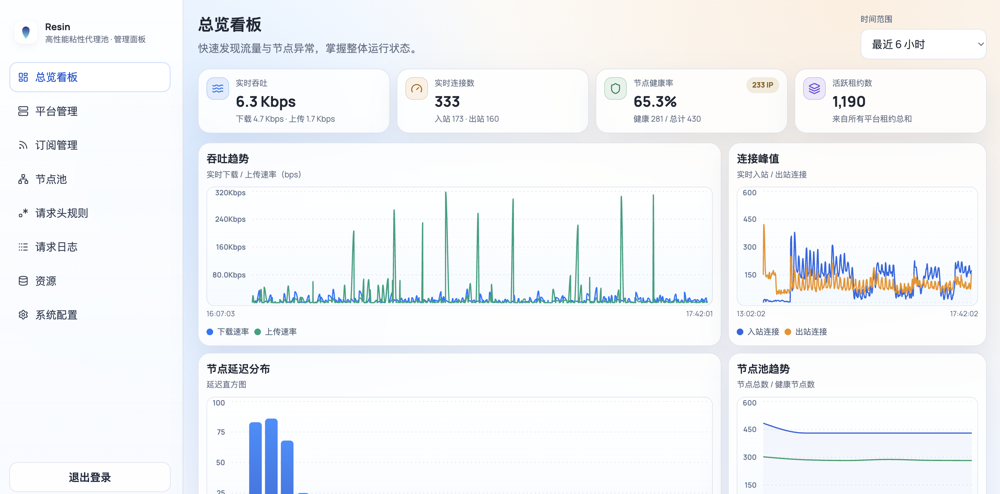

<div align="center">
  
  <h1>Resin</h1>
  <p><strong>把大量代理订阅，变成稳定、好用、可观测的代理池。</strong></p>
</div>

---

**Resin** 是一个专为接管海量节点设计的**高性能智能代理池网关**。

它可以帮你彻底屏蔽底层代理节点的不稳定性，化繁为简，将它们聚合成一个支持 **“会话保持（粘性路由）”** 的超级 HTTP 流量网关。

## 💡 为什么选择 Resin？

- **海量接管**：轻松管理十万级规模的代理节点。
- **高性能**：原生支持高并发。冷热路径分离设计。
- **智能调度与熔断**：全自动的 **被动+主动** 健康探测、出口 IP 探测、延迟分析，精准剔除坏节点。
- **业务友好的粘性代理**：让同一业务账号稳定绑定同一出口 IP，节点断线自动无感切换同 IP 节点，极致提升服务稳定性。
- **双模接入**：同时支持标准正向代理（HTTP Proxy）与 URL 反向代理（Reverse Proxy）。
- **可观测性**：提供详细的性能指标与日志记录，快速掌控全局（可视化 Web 管理后台）。



<div style="background-color: #edf7f2ff; padding: 15px; border-radius: 8px; border-left: 5px solid #539169ff; margin: 20px 0;">
  <span style="font-size: 1.1em; font-weight: bold; color: #24292e;">
    💡 提示：您可以把本文档与项目详细设计文档 <a href="DESIGN.md"><code>DESIGN.md</code></a> 丢给 AI，然后问它任何你感兴趣的问题！
  </span>
</div>

---

## 🚀 Quick Start

只需简单三步，即可将你的闲杂节点转化为高可用代理池。

### 第一步：一键部署启动
推荐使用 Docker Compose 快速启动：

```yaml
# docker-compose.yml
services:
  resin:
    image: ghcr.io/resinat/resin:latest
    container_name: resin
    restart: unless-stopped
    environment:
      RESIN_ADMIN_TOKEN: "admin123" # 修改为你的管理后台密码
      RESIN_PROXY_TOKEN: "my-token" # 修改为你的代理密码
      RESIN_LISTEN_ADDRESS: 0.0.0.0
      RESIN_PORT: 2260
    ports:
      - "2260:2260"
    volumes:
      - ./data/cache:/var/cache/resin
      - ./data/state:/var/lib/resin
      - ./data/log:/var/log/resin
```
运行 `docker compose up -d` 启动服务。

*(如果你不想使用 Docker，请跳转文末查看 [其他部署方式](#-其他部署方式))*

### 第二步：导入代理节点
1. 浏览器打开 `http://127.0.0.1:2260`（请替换为你的服务器 IP）。
2. 输入刚才设置的 `RESIN_ADMIN_TOKEN` 登录后台。
3. 在左侧菜单找到 **「订阅管理」**，添加你的节点订阅。

### 第三步：开始你的代理请求
客户端接入方式参考接下来的章节。

## 🟢 基础使用（非粘性代理）

### 简单接入代理
如果你只需要一个高性能、大容量、且会自动健康管理的通用代理池，Resin 开箱即用。
启动 Resin 服务后，给你的应用程序接入 `http://<RESIN_PROXY_TOKEN>::@127.0.0.1:2260` 代理即可。  
如果你不想设置代理密码，请将环境变量显式设为空字符串：`RESIN_PROXY_TOKEN=""`（变量必须定义）。此时可直接接入 `http://127.0.0.1:2260`。下面是使用 curl 的一个例子：


```bash
curl -x http://127.0.0.1:2260 \
  -U "my-token::" \
  https://cloudflare.com/cdn-cgi/trace
```

如果你的客户端支持修改服务的 `BASE_URL`，你也可以尝试反向代理接入。URL 格式为：`/令牌/Platform(可选):/协议/目标地址`。例如，你可以通过下面的 curl 命令通过 Resin 访问 `https://cloudflare.com/cdn-cgi/trace`。

```bash
curl http://127.0.0.1:2260/my-token/:/https/cloudflare.com/cdn-cgi/trace
```

> 正向代理与反向代理的选择：如果条件允许，推荐尽量使用反向代理，对于可观测性更友好。如果您的客户端不支持修改 BaseURL，或者客户端需要 utls、非纯 WebAPI 请求这种反向代理不擅长的情况，请使用正向代理。

### 筛选节点
如果你的服务对节点有筛选要求，例如只需要某个地区的节点，或者只需要来自某个订阅源的节点，或者只需要名字匹配特定正则表达式的节点，可以使用 Resin 的 Platform 概念来实现。

你可以打开 `http://127.0.0.1:2260/ui/platforms` Platform 管理页面，创建一个 Platform。例如希望只使用来自美国、香港的节点，你可以创建一个名为 “MyPlatform” 的 Platform，然后在地区过滤规则中填入：
```
us
hk
```

对于正向代理，你可以在 http 代理的用户信息中填入希望使用的 Platform。下面是一个 curl 的例子：

```bash
curl -x http://127.0.0.1:2260 \
  -U "my-token:MyPlatform:" \
  https://cloudflare.com/cdn-cgi/trace
```

对于反向代理，你可以在 URL 前缀中提供 Platform 信息。下面是一个使用 curl 的例子：

```
curl http://127.0.0.1:2260/my-token/MyPlatform:/https/cloudflare.com/cdn-cgi/trace
```

---

## 📖 进阶使用：粘性代理 (Sticky Session)

当业务遇到**对 IP 变化敏感**的网站，或者需要持续交互时，你需要使用 Resin 的核心特性：**粘性代理**。

在此之前，先了解两个概念：

### 🎯 核心概念：平台 (Platform) 与 账号 (Account)
- **平台 (Platform)**：节点的隔离池。你可以通过规则筛选节点（例如只使用“美国”节点）组建成一个专有池。系统默认存在一个装载所有可用节点的 `Default` 平台。
- **账号 (Account)**：业务侧的唯一标识（如 `Tom` 或 `user_1`）。携带特定 Account 的请求，Resin 会在平台中为其**硬锚定一个专属的高速出口节点**，哪怕节点突然断线，也会无缝重试并切换相同 IP，彻底解放业务端代码。

### 粘性代理接入格式
无论使用何种接入协议，认证身份的核心格式均为：`RESIN_PROXY_TOKEN:Platform:Account`。想要激活粘性路由，只需在最后加上 `Account` 即可。

#### 方式一：正向代理接入 (HTTP Proxy)
直接将身份信息写入 Proxy Auth（代理用户名）中：

```bash
# 格式：-U "密码:平台:账号"
# 指定一个业务账号 user_tom，Resin 会为其长期分配一个稳定的专属 IP
curl -x http://127.0.0.1:2260 \
  -U "my-token:Default:user_tom" \
  https://cloudflare.com/cdn-cgi/trace
```

#### 方式二：反向代理接入 (Reverse Proxy)
你可以通过替换业务的 BaseURL 为 Resin 反代地址，将请求直接发给 Resin。
URL 格式进阶为：`http://部署IP:2260/密码/平台:账号/协议/目标地址`：

```bash
# 例如让 user_tom 访问 https 协议的 cloudflare.com：
curl "http://127.0.0.1:2260/my-token/Default:user_tom/https/cloudflare.com/cdn-cgi/trace"
```

---

## 🤖 接入第三方项目

各类第三方客户端使用 Resin 的方式有所不同，对于业务代码的侵入程度也不同，总结如下：

| 需求侧 | 接入方式 | 代码侵入程度 | 说明 |
| :--- | :--- | :--- | :--- |
| **不需要粘性代理** | 接入正向代理 | 🟢 **零侵入** | 客户端填入代理地址 `http://127.0.0.1:2260` 及账号密码即可。 |
| " | 接入反向代理 | 🟢 **零/低侵入** | 修改服务 BaseURL 即可接入，适配极易。 |
| **需要粘性代理** | 接入正向代理 | 🟡 **中侵入** | 需稍微修改代码：为不同用户的请求附带不同 Account 后缀（如 `密码:平台:账号`）。 |
| " | 接入反向代理 | 🟡 **中侵入** | 需稍微修改代码：动态拼接带有账号的反代 URL 路径。 |
| " | 接入反向代理 + 请求头规则 | 🟢 **零/低侵入** | Resin 允许通过识别业务原始头（如 `Authorization`）自动提取 Account 并绑定 IP！就像普通反代一样简单！ |

👉 **极速集成脚本/提示词（Prompt）：**  
如果你需要使用原生代码接入粘性代理，你可以直接把下面这个模板喂给 AI 帮你写代码：
- [doc/integration-prompt.md](doc/integration-prompt.md)

---

## ⚙️ 其他部署方式

<details>
<summary><b>方式一：运行预编译二进制文件</b></summary>
<br>
前往项目的 <a href="https://github.com/Resinat/Resin/releases">Release</a> 页面，下载适合你操作系统架构的程序包。解压得到单个二进制文件 <code>resin</code>。

```bash
RESIN_ADMIN_TOKEN=【管理面板密码】 \
RESIN_PROXY_TOKEN=【代理密码】 \
RESIN_STATE_DIR=./data/state \
RESIN_CACHE_DIR=./data/cache \
RESIN_LOG_DIR=./data/log \
RESIN_LISTEN_ADDRESS=0.0.0.0 \
RESIN_PORT=2260 \
./resin
```
</details>

<details>
<summary><b>方式二：通过源码编译</b></summary>
<br>
前提条件：请确保环境中已安装 Go 1.25+ 和 Node.js。

```bash
# 1. 下载 Resin 源码
git clone https://github.com/Resinat/Resin.git

# 2. 编译 WebUI
cd Resin/webui
npm install && npm run build
cd ..

# 3. 编译 resin 核心
go build -tags "with_quic with_wireguard with_grpc with_utls with_embedded_tor with_naive_outbound" -o resin ./cmd/resin

# 4. 运行程序
RESIN_ADMIN_TOKEN=【管理面板密码】 \
RESIN_PROXY_TOKEN=【代理密码】 \
RESIN_STATE_DIR=./data/state \
RESIN_CACHE_DIR=./data/cache \
RESIN_LOG_DIR=./data/log \
RESIN_LISTEN_ADDRESS=127.0.0.1 \
RESIN_PORT=2260 \
./resin
```
</details>

---

## 🛠️ 常见错误 (FAQ)

- **Q: 为什么代理请求总是连不上，拿不到可用出口？**
  - **A**: 刚起步最容易踩的坑。请确保你先在管理后台导入了订阅，并确认面板上有 **健康** 的节点，再进行代理请求。
- **Q: 启动失败提示 `RESIN_PROXY_TOKEN` 未定义？**
  - **A**: 就算你不打算启用代理密码，也必须显式配置它为空：`RESIN_PROXY_TOKEN=""`。
- **Q: 使用反向代理 WebSocket 协议（如 ws/wss）怎么写路径？**
  - **A**: 目标无论是不是 ws/wss，URL 路径里的协议字段**依然只能写 `http` 或 `https`**（不能写 ws/wss）。Resin 会自动探测并完成 WebSocket 协议降级（Upgrade）。

---

## ⚠️ 免责声明与许可证

- **许可证**：本项目采用 [MIT License](LICENSE)。
- **免责声明**：本开源项目仅作为一个学术和技术研究的网络代理调度管理工具，旨在探索大规模代理节点的调度与管理策略。使用本项目的用户必须遵守其所在国家和地区的法律法规，并确保对网络资源的使用符合各服务提供商的服务条款（ToS）。开发者不对任何人因使用 Resin 造成的任何直接或间接的违法行为、违约责任及损失承担任何法律责任。请合法、合规地使用本项目。
