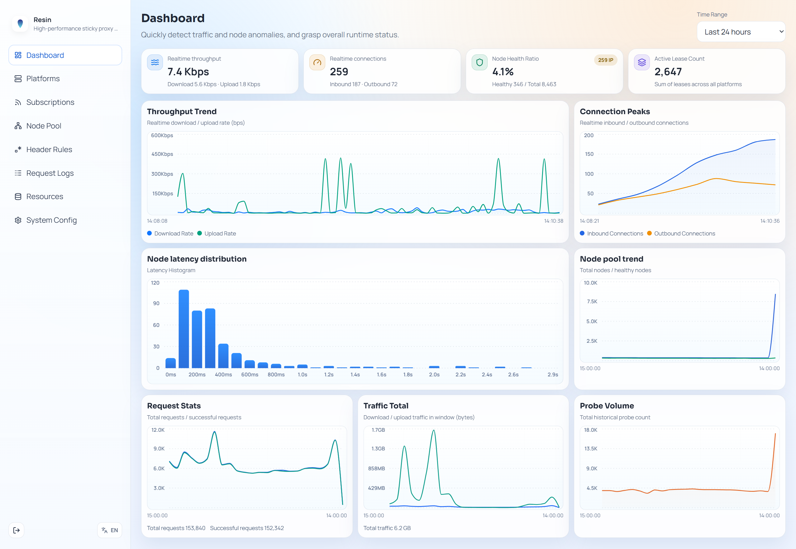

[English](README.md) | [简体中文](README.zh-CN.md)

<div align="center">
  
  <h1>Resin</h1>
  <p><strong>Turn massive proxy subscriptions into a stable, smart, and observable network with sticky sessions.</strong></p>
</div>

<p align="center">
  <a href="https://github.com/Resinat/Resin/releases"></a>
  <a href="https://github.com/Resinat/Resin/actions/workflows/release.yml"></a>
  <a href="https://github.com/Resinat/Resin/pkgs/container/resin"></a>
  <a href="https://github.com/Resinat/Resin/blob/master/LICENSE"></a>
  <a href="https://github.com/Resinat/Resin/blob/master/go.mod"></a>
  <a href="https://github.com/Resinat/Resin/releases"></a>
  <a href="DESIGN.md"></a>
</p>

---

**Resin** is a **high-performance intelligent proxy pool gateway** built for operating massive numbers of proxy nodes.

It helps shield your services from unstable upstream proxies and aggregates them into a single HTTP gateway with **session stickiness (sticky routing)**.

## 💡 Why Resin?

- **Massive-scale management**: Easily handles 100k+ proxy nodes with native high-concurrency performance.
- **Smart scheduling and circuit breaking**: Fully automated **passive + active** health checks, outbound IP probing, and latency analysis to remove bad nodes precisely. Uses P2C plus domain-aware latency-weighted scoring for optimal node selection.
- **Business-friendly sticky proxying**: Keeps the same business account bound to a stable outbound IP. If a node fails, Resin seamlessly switches to another node with the same IP.
- **Dual access modes**: Supports both standard forward proxy (HTTP Proxy) and URL-based reverse proxy.
- **Observability**: Detailed metrics and logs, plus a visual Web UI. Includes complete structured request logs for querying and auditing by platform, account, target site, and more.
- **Simple and powerful**: Works out of the box with default settings, while still offering deep customization for enterprise-grade needs.
- **Cross-subscription deduplication**: Automatically merges identical nodes from different subscriptions and shares their health state.
- **Hot reload**: Update common settings without restart. Refresh subscriptions without dropping existing traffic.
- **Persistent state**: Keeps node health, latency stats, and lease bindings across restarts.
- **Zero-intrusion sticky access**: Can extract account identity from existing request headers (for example API keys), so clients often need no code changes.
- **Incremental subscription refresh**: Syncs subscription updates without interrupting current connections.
- **Flexible node isolation**: Use Platform rules (regex, region, etc.) to build independent proxy pools for different business scenarios.

> [!TIP]
> You can feed this README and [`DESIGN.md`](DESIGN.md) to AI and ask it anything about the project.



---

## 🚀 Quick Start

In just three steps, you can turn your proxy subscriptions into a highly available proxy pool.

### Step 1: Deploy and start

Docker Compose is the recommended quick-start path:

```yaml
# docker-compose.yml
services:
  resin:
    image: ghcr.io/resinat/resin:latest
    container_name: resin
    restart: unless-stopped
    environment:
      RESIN_ADMIN_TOKEN: "admin123" # Change to your admin dashboard password
      RESIN_PROXY_TOKEN: "my-token" # Change to your proxy password
      RESIN_LISTEN_ADDRESS: 0.0.0.0
      RESIN_PORT: 2260
    ports:
      - "2260:2260"
    volumes:
      - ./data/cache:/var/cache/resin
      - ./data/state:/var/lib/resin
      - ./data/log:/var/log/resin
```

Run `docker compose up -d` to start the service.

*(If you don't want Docker, jump to [Other Deployment Options](#other-deployment-options).)*

### Step 2: Import proxy nodes

1. Open `http://127.0.0.1:2260` in your browser (replace with your server IP if needed).
2. Log in with the `RESIN_ADMIN_TOKEN` you set.
3. Go to **Subscriptions** in the left menu and add your node subscription.
4. Wait briefly for the node pool to refresh.

### Step 3: Start sending proxy requests

Use one of the client access modes in the following sections.

## 🟢 Basic Usage (Non-sticky Proxy)

### Connect as a standard proxy

If you just need a high-performance, large-capacity proxy pool with automatic health management, Resin works out of the box.

Once Resin is running, point your app to `http://<RESIN_PROXY_TOKEN>::@127.0.0.1:2260`.
If you do not want a proxy password, explicitly set `RESIN_PROXY_TOKEN=""` (the variable must still be defined). Then connect directly to `http://127.0.0.1:2260`.

Example with curl:

```bash
curl -x http://127.0.0.1:2260 \
  -U "my-token::" \
  https://api.ipify.org
```

If your client supports overriding `BASE_URL`, you can also use reverse-proxy mode.
URL format: `/token/Platform(optional):/protocol/target`.
Example request to `https://api.ipify.org`:

```bash
curl http://127.0.0.1:2260/my-token/:/https/api.ipify.org
```

> Choosing forward vs reverse proxy: when possible, reverse proxy is recommended for better observability. If your client cannot change BaseURL, or requires scenarios better served by forward proxy (such as uTLS or non-WebAPI traffic), use forward proxy.

### Filter nodes

If your service needs specific nodes (for example by region, subscription source, or name regex), use Resin's Platform feature.

Open `http://127.0.0.1:2260/ui/platforms` and create a Platform. For example, to use only US and HK nodes, create `MyPlatform` and set region filters to:

```
us
hk
```

For forward proxy, put Platform in proxy auth info:

```bash
curl -x http://127.0.0.1:2260 \
  -U "my-token:MyPlatform:" \
  https://api.ipify.org
```

For reverse proxy, include Platform in the URL prefix:

```bash
curl http://127.0.0.1:2260/my-token/MyPlatform:/https/api.ipify.org
```

## 🔌 Supported Protocols and Subscription Formats

### Access protocols

- Forward proxy inbound: HTTP proxy, including regular HTTP requests and HTTPS tunneling via `CONNECT`.
- Reverse proxy inbound: URL mode `/token/platform:account/protocol/host/path`, where `protocol` supports `http` and `https`.
- WebSocket in reverse mode: `ws`/`wss` upgrades are supported, but the URL `protocol` segment must still be `http` (for `ws`) or `https` (for `wss`).

### Subscription sources

- Remote subscription URL: `http://` or `https://`.
- Local subscription content: paste subscription content directly in the UI/API.

### Subscription content formats

- sing-box JSON: `{"outbounds":[...]}` or raw outbound array `[...]`.
- Clash JSON/YAML: `{"proxies":[...]}` or YAML `proxies:`.
- URI line format (one node per line): `vmess://`, `vless://`, `trojan://`, `ss://`, `hysteria2://`.
- Plain HTTP proxy lines: `IP:PORT` or `IP:PORT:USER:PASS` (IPv4 and IPv6).
- Base64-wrapped text subscriptions (for URI lines/plain-text node lists).

### Supported outbound node types

- For sing-box JSON/raw outbounds: `socks`, `http`, `shadowsocks`, `vmess`, `trojan`, `wireguard`, `hysteria`, `vless`, `shadowtls`, `tuic`, `hysteria2`, `anytls`, `ssh`.
- For Clash conversion: `ss`/`shadowsocks`, `vmess`, `vless`, `trojan`, `hysteria2`/`hy2`.

---

## 📖 Advanced Usage: Sticky Session Proxy

When your business depends on IP continuity or long-lived interactions, use Resin's core feature: **sticky proxying**.

First, understand two core concepts:

### 🎯 Core Concepts: Platform and Account

- **Platform**: An isolated node pool. You can build it with filters (for example, only US nodes). Resin provides a default `Default` platform containing all available nodes.
- **Account**: A unique business identity (for example `Tom` or `user_1`). For requests carrying an Account, Resin anchors traffic to a dedicated high-quality outbound node. If that node fails, Resin retries seamlessly and switches to another node with the same IP.

### Sticky auth format

Across all access protocols, the auth identity format is: `RESIN_PROXY_TOKEN:Platform:Account`.
To enable sticky routing, provide `Account`.

#### Method 1: Forward proxy (HTTP Proxy)

Write identity directly in proxy auth username:

```bash
# Format: -U "token:platform:account"
# Bind business account user_tom to a stable dedicated outbound IP
curl -x http://127.0.0.1:2260 \
  -U "my-token:Default:user_tom" \
  https://api.ipify.org
```

#### Method 2: Reverse proxy (URL mode)

By replacing your service BaseURL with Resin reverse-proxy URL, traffic goes through Resin directly.
Advanced URL format: `http://host:2260/token/platform:account/protocol/target`:

```bash
# Example: user_tom accesses api.ipify.org over https
curl "http://127.0.0.1:2260/my-token/Default:user_tom/https/api.ipify.org"
```

#### Method 3: Reverse proxy + header rules (zero-intrusion)

If your client or SDK cannot dynamically append `Account` in reverse-proxy URLs, Resin can extract Account from your existing business headers (for example API Key, Token, Cookie).

In many cases, this means you only change a static `BaseURL`, with no business logic changes.

Assume your requests already include an `Authorization` header:

1. In Platform Configuration, set `Reverse-proxy empty-account behavior` to `Extract specified request headers as Account`.
2. Set `Headers used to extract Account` to `Authorization`.

Then even if Account is omitted in URL, Resin will parse it from headers:

```bash
curl "http://127.0.0.1:2260/my-token/MyPlatform:/https/api.example.com/v1/orders" \
  -H "Authorization: sk-abc123"
```

In this example, Resin uses `sk-abc123` as Account. Future requests with the same key are intended to stay bound to the same outbound IP whenever routing conditions allow.

> [!IMPORTANT]
> Enable header-based Account extraction only when you have a valid legal basis (for example user authorization or contractual permission), and ensure your logging, retention, and access-control policies comply with applicable laws and target-service terms.

> Beyond Platform header config, Resin also supports advanced rules that pick extraction headers by URL prefix. You can ask AI to explain both modes with this README and [DESIGN.md](DESIGN.md).

---

## 🤖 Integrating Third-party Projects

Different clients integrate Resin differently, with different code-intrusion levels.

💡 **If you do not need sticky proxying**

| Access Method | Code Intrusion | Notes |
| :--- | :--- | :--- |
| Forward proxy | 🟢 **Zero intrusion** | Just configure proxy address `http://127.0.0.1:2260` and credentials. |
| Reverse proxy | 🟢 **Zero/low intrusion** | Usually only requires changing service BaseURL. |

💡 **If you need sticky proxying**

| Access Method | Code Intrusion | Notes |
| :--- | :--- | :--- |
| Forward proxy | 🟡 **Medium intrusion** | Per-user requests need different auth info, such as `token:platform:account`. |
| Reverse proxy | 🟡 **Medium intrusion** | Build reverse-proxy URL paths dynamically with account information. |
| Reverse proxy + header rules | 🟢 **Zero/low intrusion** | Resin can extract Account from original headers (for example `Authorization`) and bind IP automatically. |

👉 **Fast integration script/prompt:**
If you are a developer and want AI to help modify an existing project for native Resin sticky integration, use:

- [doc/integration-prompt.md](doc/integration-prompt.md)

---

## Other Deployment Options

<details>
<summary><b>Option 1: Run prebuilt binary</b></summary>
<br>
Go to the project's <a href="https://github.com/Resinat/Resin/releases">Release</a> page and download the package for your OS/architecture. After extraction, run the single binary <code>resin</code>.

```bash
RESIN_ADMIN_TOKEN=<admin-dashboard-password> \
RESIN_PROXY_TOKEN=<proxy-password> \
RESIN_STATE_DIR=./data/state \
RESIN_CACHE_DIR=./data/cache \
RESIN_LOG_DIR=./data/log \
RESIN_LISTEN_ADDRESS=0.0.0.0 \
RESIN_PORT=2260 \
./resin
```
</details>

<details>
<summary><b>Option 2: Build from source</b></summary>
<br>
Prerequisites: Go 1.25+ and Node.js installed.

```bash
# 1. Clone Resin source
git clone https://github.com/Resinat/Resin.git

# 2. Build WebUI
cd Resin/webui
npm install && npm run build
cd ..

# 3. Build Resin core
go build -tags "with_quic with_wireguard with_grpc with_utls" -o resin ./cmd/resin

# 4. Run
RESIN_ADMIN_TOKEN=<admin-dashboard-password> \
RESIN_PROXY_TOKEN=<proxy-password> \
RESIN_STATE_DIR=./data/state \
RESIN_CACHE_DIR=./data/cache \
RESIN_LOG_DIR=./data/log \
RESIN_LISTEN_ADDRESS=127.0.0.1 \
RESIN_PORT=2260 \
./resin
```
</details>

---

## 🛠️ FAQ

- **Q: Startup fails with `RESIN_PROXY_TOKEN` undefined?**
  - **A**: Even if you do not want a proxy password, you must explicitly set it to empty: `RESIN_PROXY_TOKEN=""`.
- **Q: How to write reverse-proxy paths for WebSocket (ws/wss)?**
  - **A**: In the URL path, the protocol field must still be `http` or `https` (not `ws`/`wss`). Resin auto-detects and handles WebSocket upgrade.

---

## ⚠️ License and Disclaimer

- **License**: This project is licensed under the [MIT License](LICENSE).
- **Use scope**: This project is provided for technical research and engineering practice in proxy scheduling and management. It does not constitute legal, compliance, audit, or security advice.
- **Lawful use requirement**: You are responsible for ensuring your usage complies with applicable laws, regulations, target-service Terms of Service (ToS), and data-processing obligations, and for ensuring you have proper authorization for proxy nodes, target resources, and related data.
- **Prohibited use**: You must not use this project for unauthorized access, control-evasion, fraud, attacks, abusive traffic generation, or other illegal or non-compliant activity.
- **No warranty**: This project is provided on an "AS IS" basis, without express or implied warranties, including but not limited to merchantability, fitness for a particular purpose, and non-infringement.
- **Limitation of liability**: To the maximum extent permitted by applicable law, authors and contributors are not liable for any direct, indirect, incidental, special, exemplary, or consequential damages arising from use of, or inability to use, this project.
